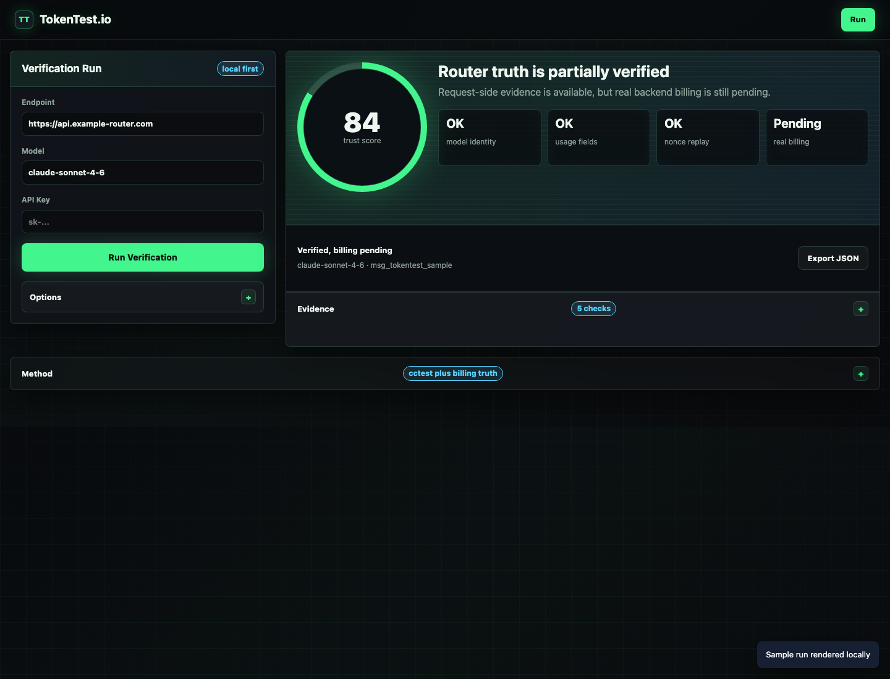

<div align="center">

<p align="right">
   <a href="../README.md">English</a> | <strong>中文</strong> | <a href="./README.jp.md">日本語</a>
</p>

# TokenTest

### 在生产环境之前，验证模型、路由、用量与安全性。

面向 AI 路由、采购团队和 CI 流程的黑盒模型验证工具。

[在线使用](https://tokentest.io) · [产品手册](https://tokentest.io/manual.html) · [远程 MCP](https://tokentest.io/docs/remote-mcp.md) · [GitHub](https://github.com/SolveaCX/tokentest.io)


<br>

🚀 **[立即在线运行 TokenTest →](https://tokentest.io)**

</div>

TokenTest 是面向 AI 中间层采购方的生产参考评测层。它从外部测试 OpenAI-compatible 或 Anthropic 风格的路由，比较请求模型与实际返回模型，审计 Token 用量，检测安全与通道行为，并将证据转化为生产准入结论。

TokenTest 不是 AI 网关：它不会代理你的业务流量、管理供应商 Key，也不会承诺提升上游 SLA。它帮助你在把路由接入网关之前，判断这条路由是否可信。

<div align="center"></div>

## TokenTest 能做什么？

- 在网页控制台评测单个模型或批量模型。
- 从 OpenAI-compatible `/models` 接口发现模型。
- 检测静默模型降级、协议不匹配、可疑 Token 数字和端点故障。
- 用六个生产参考维度统一查看身份、确定性输出、通道、Token、安全和稳定性。
- 通过 `npx tokentest evaluate` 在 CI 中执行严格准入门禁。
- 通过 MCP 连接 Claude Desktop、Cursor、VS Code 或其他兼容客户端。
- 导出 JSON、CSV、HTML 和 JUnit 证据，用于采购、发布评审和事故复盘。
- 仅在浏览器本地保存历史，API Key 与原始鉴权证据不会写入历史。

## 快速开始

### 1. 打开在线评测控制台

访问 [tokentest.io](https://tokentest.io)，填入路由地址、测试专用 Key 和一个或多个模型 ID。路由开放 `/models` 时，可以点击“自动发现模型”，然后选择快速或深度评测。

### 2. 在 CI 中执行准入检查

```bash
TOKENTEST_BASE_URL="https://api.example.com/v1" \
TOKENTEST_API_KEY="$MODEL_API_KEY" \
TOKENTEST_MODELS="model-a,model-b" \
npx tokentest evaluate \
  --min-score 80 \
  --format junit \
  --output tokentest.junit.xml
```

只有当所有模型达到分数阈值、得到 `production_reference_pass`、没有关键身份/鉴权/Token 门禁失败，并且评测完整结束时，命令才会返回 `0`。

### 3. 本地运行

```bash
git clone https://github.com/SolveaCX/tokentest.io.git
cd tokentest.io
npm install
npm start
```

控制台地址为 `http://localhost:8080`。本地 stdio MCP 服务：

```bash
npm run mcp
```

## CLI 参数

命令行参数优先于环境变量：

| 参数 | 环境变量 | 说明 |
| --- | --- | --- |
| `--base-url <url>` | `TOKENTEST_BASE_URL` | 路由基础地址。 |
| `--api-key <key>` | `TOKENTEST_API_KEY` | 上游路由/模型 Key，仅在本次进程内使用。 |
| `--model <id>` | `TOKENTEST_MODELS` | 可重复或逗号分隔的模型 ID。 |
| `--provider openai\|anthropic` | `TOKENTEST_PROVIDER` | 可选协议提示。 |
| `--min-score 0..100` | `TOKENTEST_MIN_SCORE` | 最低分，默认 `80`。 |
| `--deep` | — | 开启更深覆盖率探测。 |
| `--format summary\|json\|junit` | `TOKENTEST_FORMAT` | 输出格式，默认 `summary`。 |
| `--output <file>` | `TOKENTEST_OUTPUT` | 写入指定文件。 |

退出码：`0` 全部通过；`1` 评测完成但至少一个模型未准入；`2` 参数或配置无效；`3` 评测无法完成或模型返回错误。

## 六个生产参考维度

| 维度 | 权重 | 检测内容 |
| --- | ---: | --- |
| **D1 · 身份与协议完整性** | 30% | 请求/实际模型、响应结构、模型列表、Nonce 重放、Header 溯源和鉴权兼容性。 |
| **D2 · 输出纪律与确定性任务** | 30% | 严格 JSON、多约束遵循、语言格式、数学、逻辑、代码、表格、反事实和证明检查。 |
| **D3 · 通道与输出完整性** | 5% | 工具、视觉、文档、Web Search、长输出、SSE、Delta、思考字段和结束信号。 |
| **D4 · Token 计量可信度** | 15% | 用量存在性、总量一致性、输入单调性、输出合理性、截断联动、流式用量和缓存证据。 |
| **D5 · 安全鲁棒性** | 10% | 良性请求、Prompt 注入、密钥保护、危险代码边界、不完整安全输出和错误泄露。 |
| **D6 · 稳定性、可靠性与合规** | 10% | 端点生成风险、P50/P95/P99 延迟、TTFT 和短时成功率。 |

高总分不能覆盖生产门禁；P0/P1 失败和关键证据缺失仍会反映在风险判定中。

## 报告与 MCP

报告支持 JSON、CSV、HTML 和 JUnit。报告会区分“评测错误导致无评分”和“模型能力低分”，不会把网络、鉴权或超时错误静默转换成能力分数。

TokenTest 提供本地 stdio MCP 和远程 Streamable HTTP MCP：

- `discover_models`：发现路由公开的模型 ID；
- `evaluate_model`：返回单模型 D1-D6、风险门禁、覆盖率和脱敏证据；
- `evaluate_batch`：批量评测并返回汇总。

远程 MCP 生产策略、限流、私网地址防护和鉴权配置见 [docs/remote-mcp.md](../docs/remote-mcp.md)。

## 隐私、安全与路线图

- 上游 API Key 仅按次使用，不写入浏览器历史或 CLI 报告。
- 远程 MCP 返回的授权证据会脱敏；公共模式启用来源校验、限流、批量上限和私网 URL 拦截。
- 浏览器历史只保存在本地，可导出或删除，不会同步到服务端。
- 未来计划包括定时回归与趋势看板、成本对比、组织级准入策略、团队协作和更丰富的音频/实时能力。

## 开发与贡献

```bash
npm install
npm start
npm run test:evaluator
npm run test:server
npm run test:mcp
npm run test:http-mcp
npm run test:e2e
npm run test:visual
```

修改评分逻辑时，请同步添加确定性 fixture，并说明变化影响的是验真、生产兼容性还是可选通道证据。不要在 issue、报告、截图或测试 fixture 中提交真实 API Key 和原始鉴权头。

本项目采用 [Apache License 2.0](../LICENSE) 授权。TokenTest 名称和 Logo 是 SolveaCX 的商标；除合理描述项目来源外，本许可证不授予其产品标识使用权。
